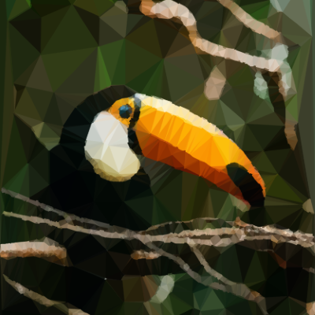
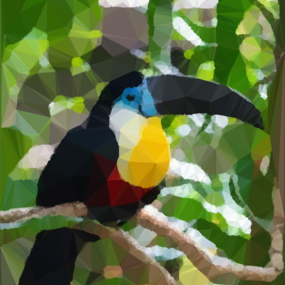
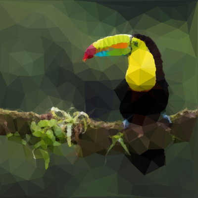
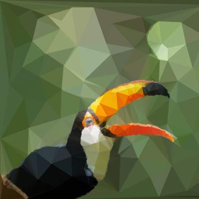
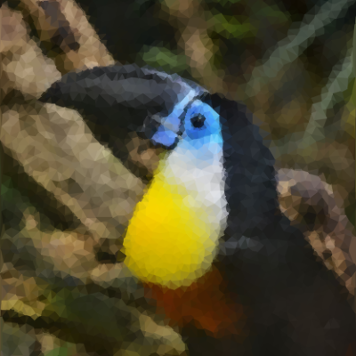

# Toucan 

**Toucan** gives your images an artsy low-poly effect.   
We do so by creating a Delauney triangulation over a set of points.  
The points are determined using Poisson disc sampling, SIFT keypoints and a Canny edge detector.

-----
## Gallery

Some examples of results. All original images are from _[unsplash.com](https://unsplash.com/)_

-----
## Walkthrough

The first tab you see when you open the app provides a more thorough explanation for the successive steps.

-----
The first step is to load our image in the "Load" tab.  
You will see a uniformly sampled result preview on the right side.
Because of the uniform basis sampling that is being applied, loading the image could take a while. 

-----
In the "Uniform" tab we can modify the uniform basis sampling.  
This is done using Poisson disc sampling with a configurable radius:

-----
By sampling the edges using a Canny edge detector, we can bring back a bit more detail:

-----
Finally to bring back some final highlights we sample some SIFT keypoints:

-----
The result is a colored Delauney Triangulation of all points added in the previous steps.  
Don't forget to save your results using the button in the bottom right.  
Have fun!!
