# Toucan 
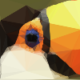

**Toucan** gives your images an artsy low-poly effect.   
We do so by creating a Delauney triangulation over a set of points.  
The points are determined using Poisson disc sampling, SIFT keypoints and a Canny edge detector.  
Results are saved as SVG and PNG.

-----
## Gallery

Some examples of results. All original images are from _[unsplash.com](https://unsplash.com/)_

**Make sure to click these images to open the corresponding *SVGs*!**

    

        <a href="https://github.com/berryvansomeren/toucan/assets/6871825/4fb2f45a-7d82-4911-b5a2-f811a4d8c007">
            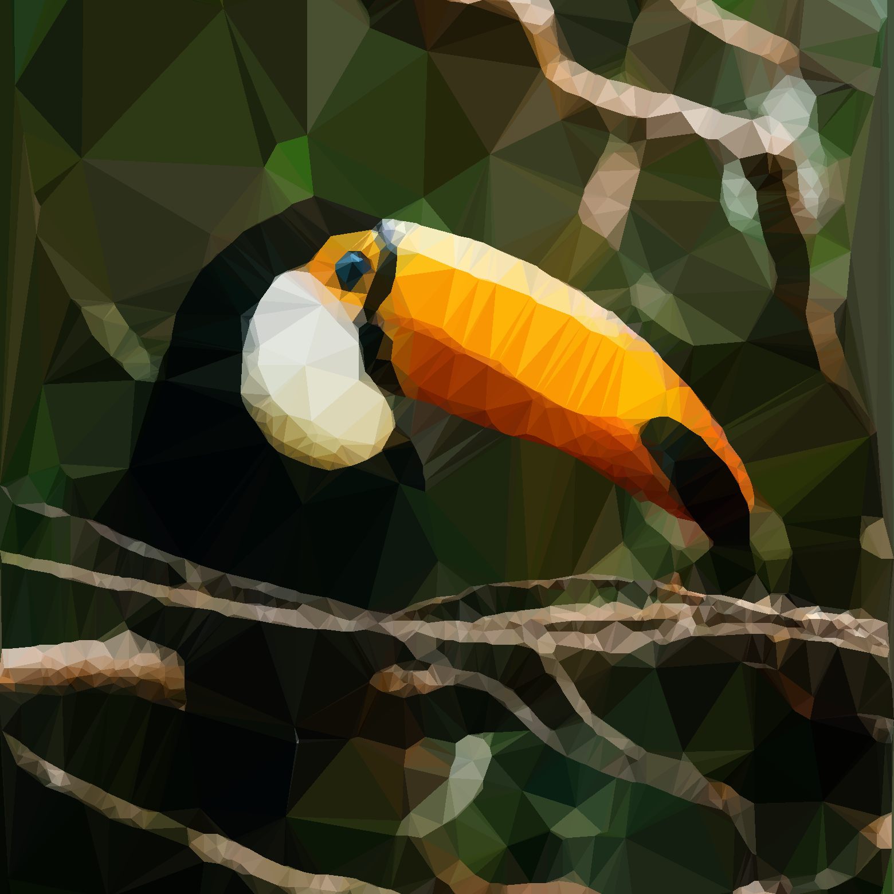
        </a>
        <a href="https://github.com/berryvansomeren/toucan/assets/6871825/d40b691e-e336-4a30-a128-b2d619c4e5a7">
            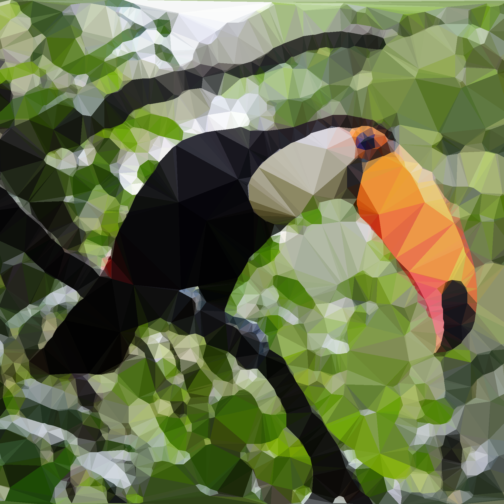
        </a>
    

    

        <a href="https://github.com/berryvansomeren/toucan/assets/6871825/b76389b0-5913-47f7-bf3c-c9e65757fdd4">
            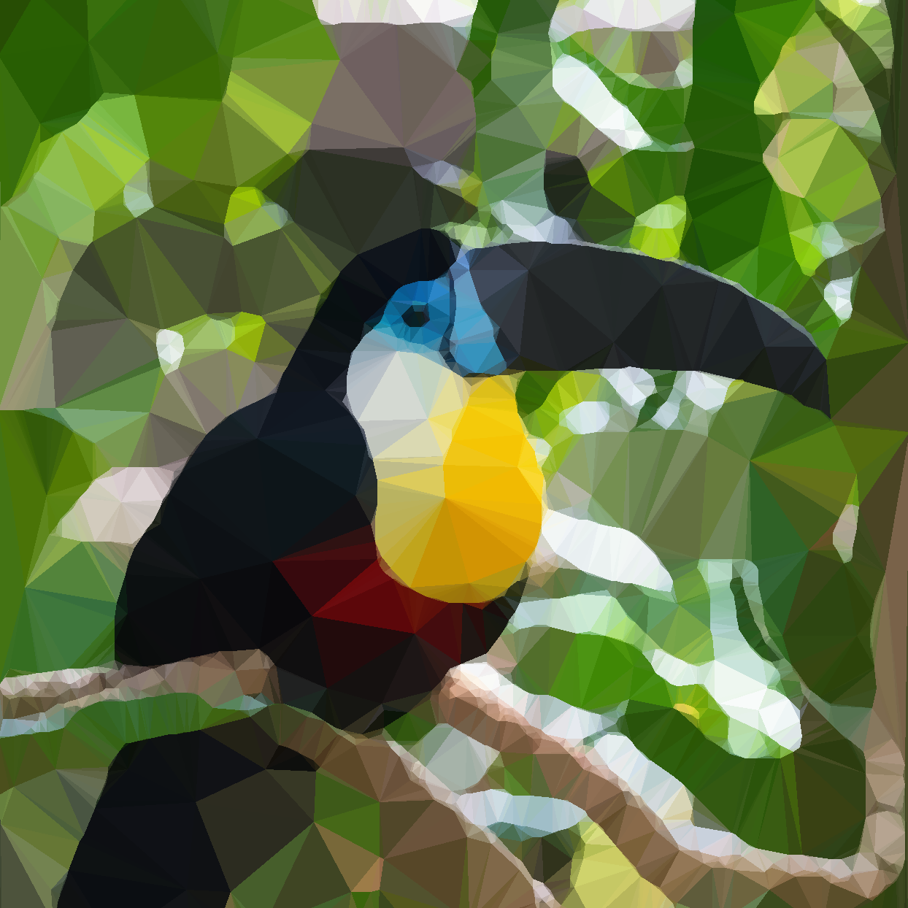
        </a>
        <a href="https://github.com/berryvansomeren/toucan/assets/6871825/08b851b3-d0eb-4a4a-a4c0-a49f6dffece8">
            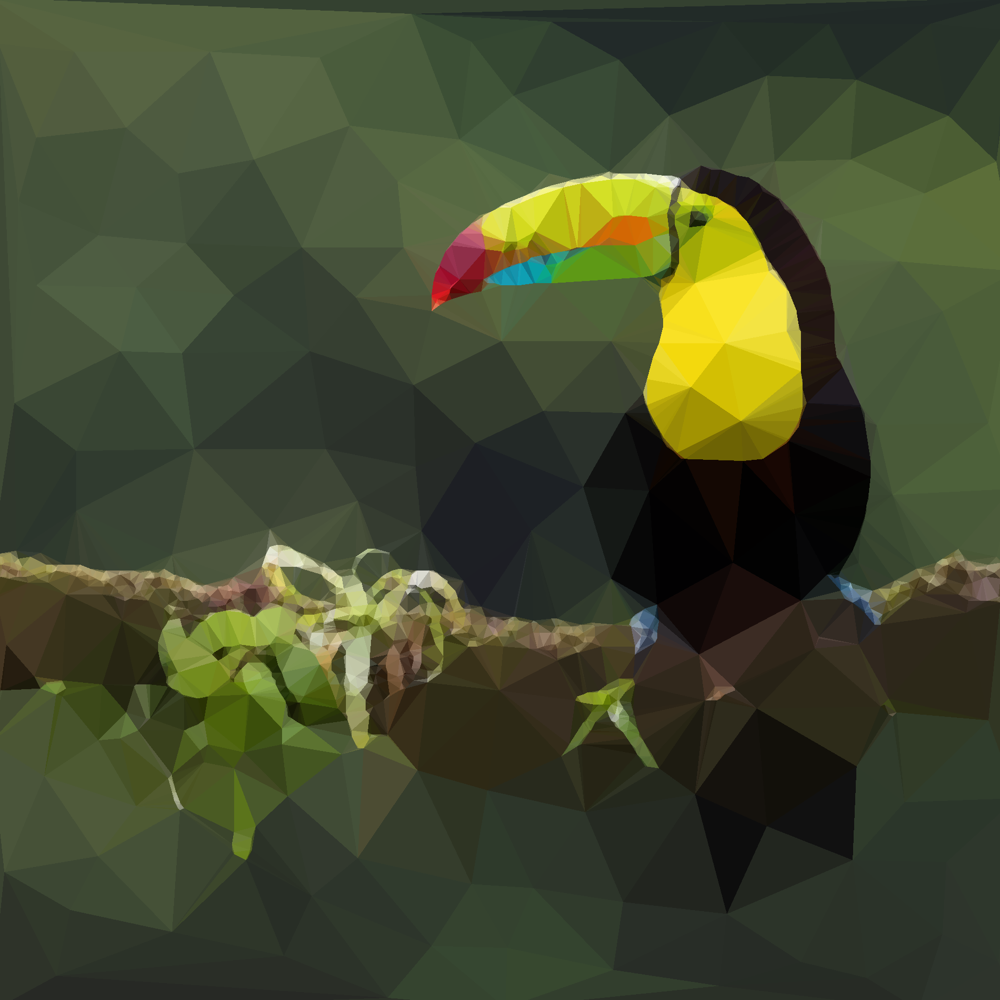
        </a>
    

    

        <a href="https://github.com/berryvansomeren/toucan/assets/6871825/61770ffd-2ff4-4801-809c-5be1adcdd4b9">
            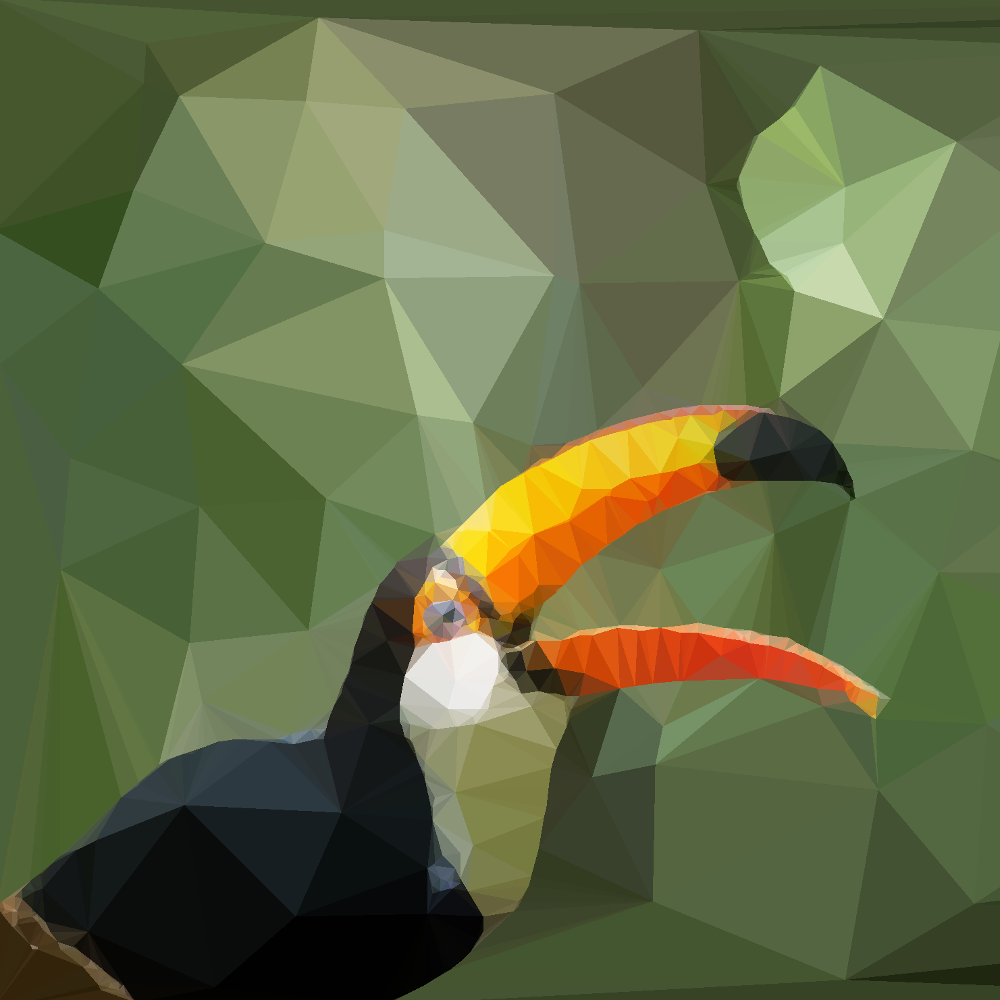
        </a>
        <a href="https://github.com/berryvansomeren/toucan/assets/6871825/17162b60-0fcf-4686-b48d-2760f5141289">
            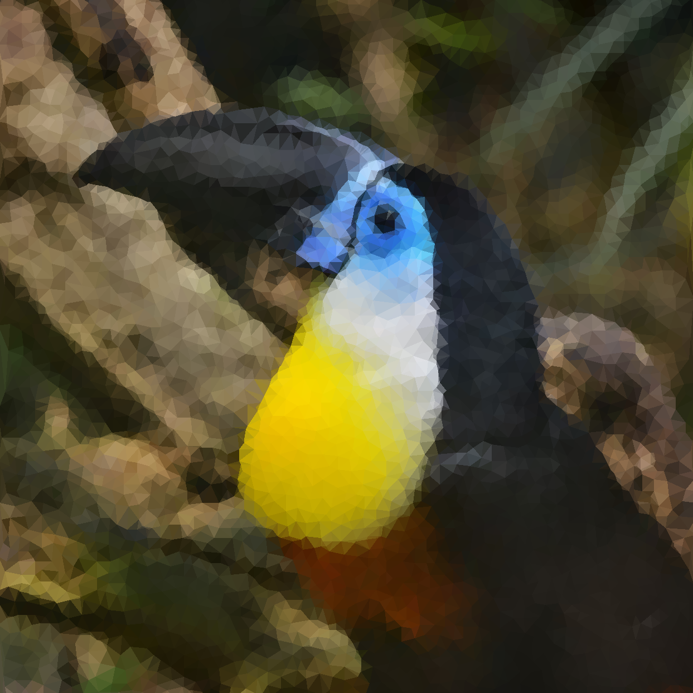
        </a>
    

-----
## Walkthrough

The first tab you see when you open the app provides a more thorough explanation for the successive steps.

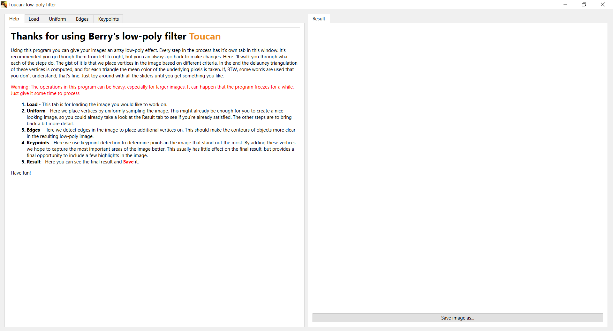

-----
The first step is to load our image in the "Load" tab.  
You will see a uniformly sampled result preview on the right side.
Because of the uniform basis sampling that is being applied, loading the image could take a while. 

Note that the input image size has a significant impact on computation time!
However, since the output is also written as an SVG, you do not have to worry about the quality of the results.
I suggest that you use the smallest image size possible that still allows you to judge the visual quality of the results while using the program, 
while keeping in mind the results you see in the application are a temporary raster representation that will ultimately be written as SVG.

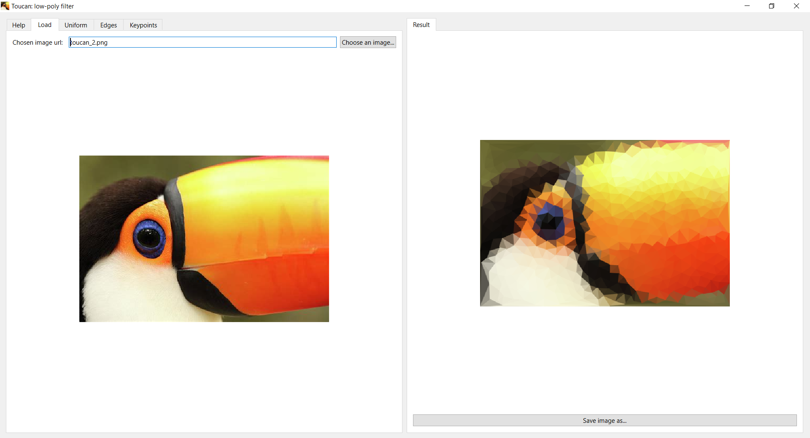

-----
In the "Uniform" tab we can modify the uniform basis sampling.  
This is done using Poisson disc sampling with a configurable radius:

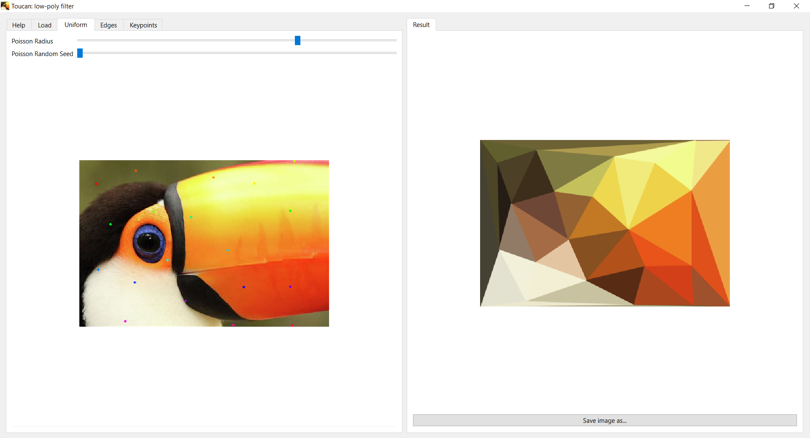

-----
By sampling the edges using a Canny edge detector, we can bring back a bit more detail:

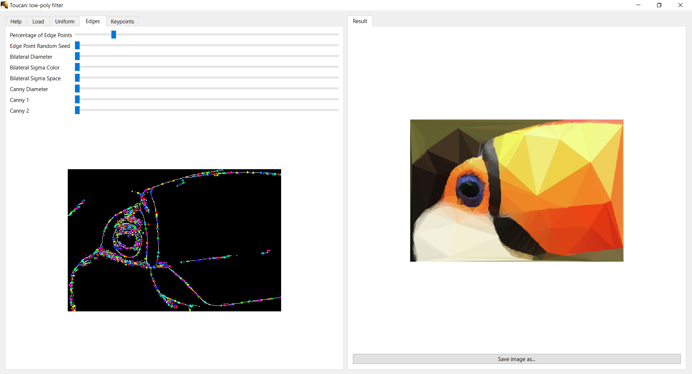

-----
Finally to bring back some final highlights we sample some SIFT keypoints:

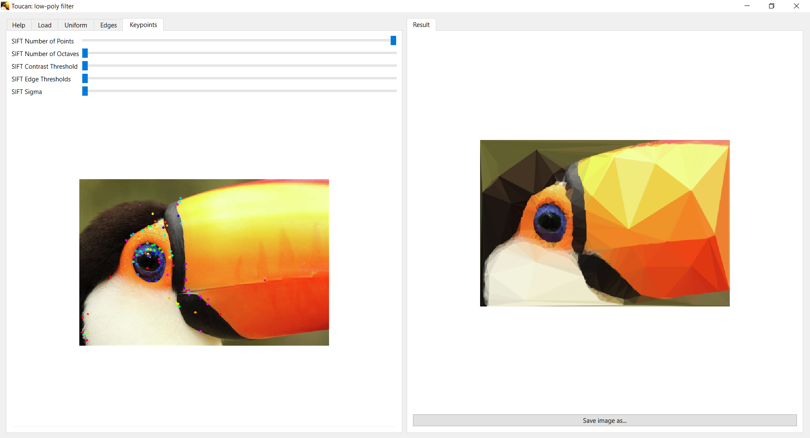

-----
The result is a colored Delauney Triangulation of all points added in the previous steps.  
Don't forget to save your results using the button in the bottom right.  
Have fun!!
